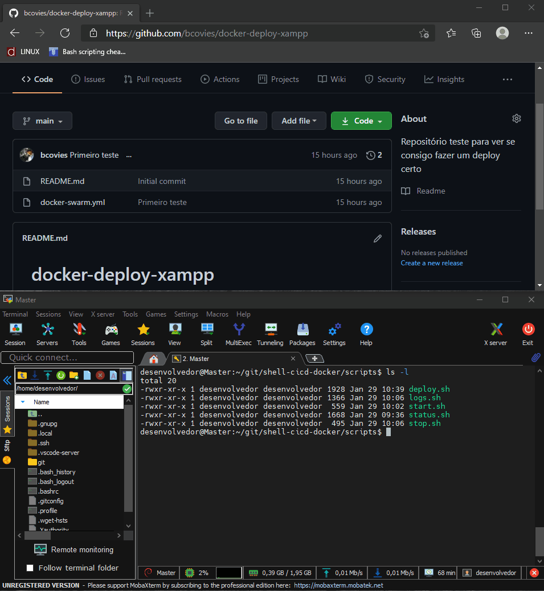
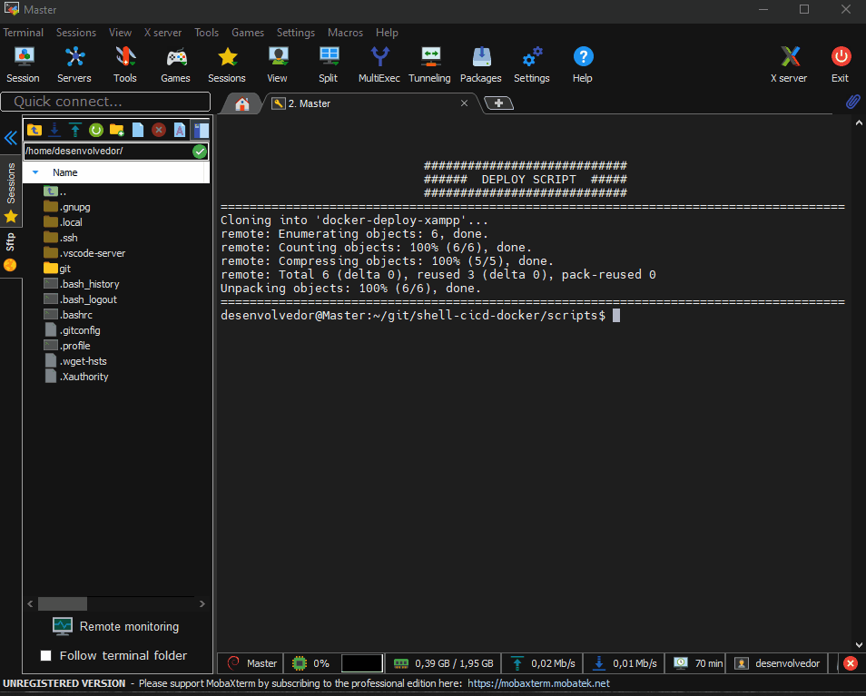

# cicd-docker
### Main idea is to make more confortable to work along with docker swarm

For that was made 5 scripts:
* deploy 
* start
* stop
* status
* logs

## How to use it?
### First of all you will need to setup a whole bunch of things, such as:
* docker swarm at leat 2 nodes which 1 will work as worker and 1 as manager
* the node must have tcp connection with docker -H NODE1 <'command'> feature
* user to execute this scripts need to be in sudders list

# Usage

### Deploying your first application:

* deploy.sh needs 4 inputs
    - 
    - https to clone github
    - name of project from github
    - dir to deploy git file + scripts to manage stack
    - dir to deploy volume of stack

    

### Using your first deploy:
* start.sh / stop.sh
    - 
    - No inputs, just execute to starts or stop the stack
* logs.sh / status.sh
    -
    - No inputs, just execute to get info of application
    
    

# needs to update

systemctl daemon-reload

./help

adicionar permissão de grupo do usuário